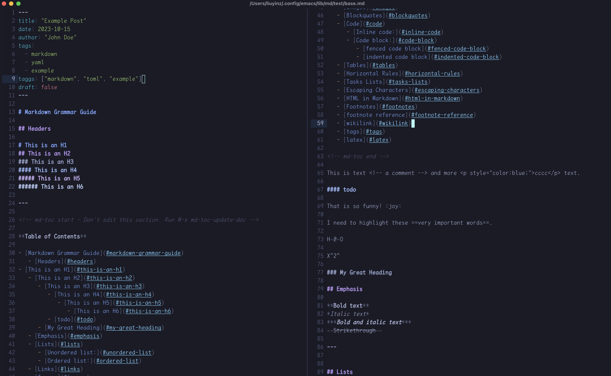
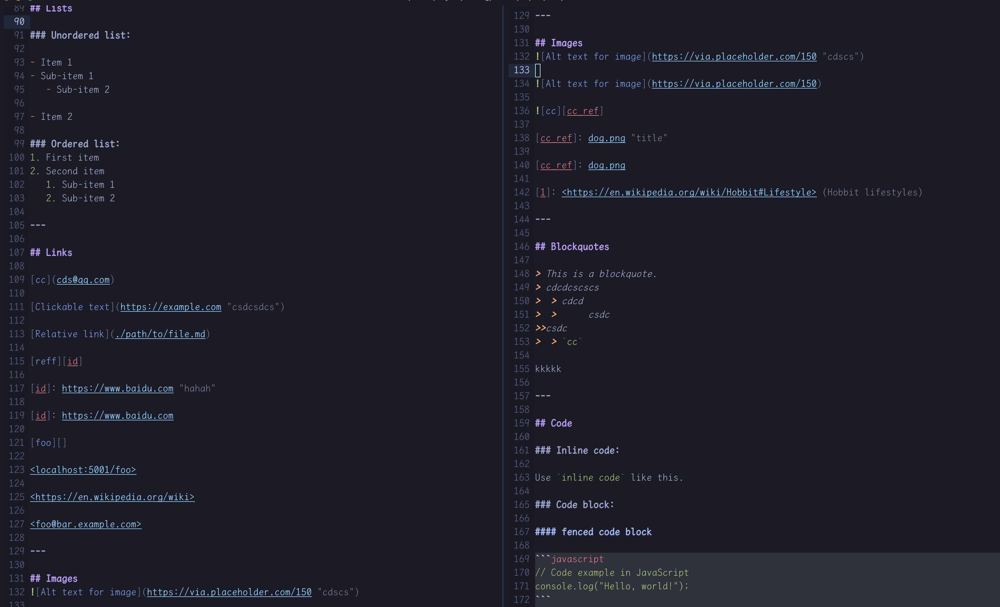
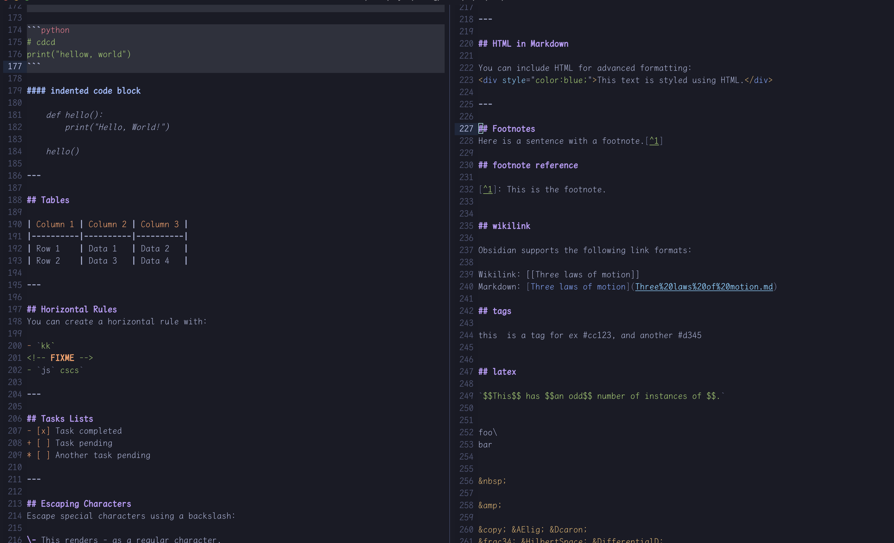

# WIP

## markdown for emacs

This package provide markdown tools based on tree-sitter.

- `md-ts-mode`

- `md-toc`

## dependencies

- emacs, version > 30.1
- tree-sitter grammar for `markdown` and `markdown-inline`

## Usage

Install parsers with `md-ts-mode-install-parsers`, include

- markdown
- markdown-inline
- html (optional)
- yaml (optional)
- toml (optional)


```elisp
(require 'md-ts-mode)
(require 'md-toc)
(add-hook 'md-ts-mode-hook #'md-toc-mode)
```


## Sceenshots



